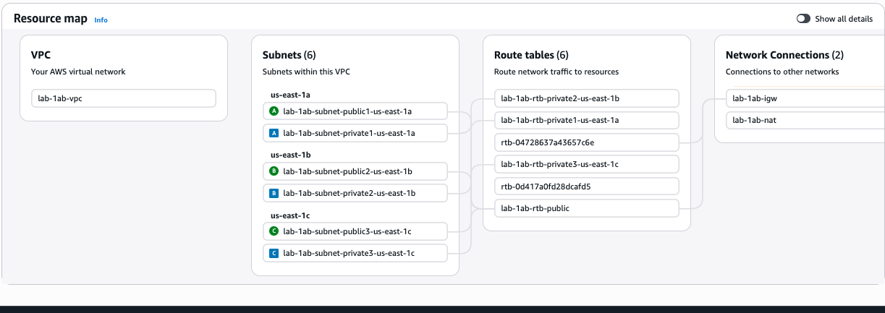

md

#🚀 Lab 1a — Secure EC2 → RDS Integration

## Foundational AWS Cloud Application Architecture

---

## Project Overview

This lab demonstrates a production-style AWS backend architecture  where:

- Amazon EC2 runs an application server
- Amazon RDS (MySQL) serves as a managed database
- Security Groups enforce least privilege networking
- IAM roles eliminate static credentials
- AWS Secrets Manager securely stores database credentials

The objective is not application complexity — the objective is secure infrastructure design and verification.

This architecture pattern is used in:
- SaaS platforms  
- Enterprise backend services  
- DevOps environments  
- Cloud security assessments  
- Lift-and-shift workloads  

---

## 🏗 Architecture Overview

This lab was built using a layered cloud architecture model.  
Each layer enforces a specific responsibility and security boundary.

1. VPC creates the isolated network boundary (Network Foundation)
2. Security Groups define allowed communication (Nework Access Control)
3. RDS provides managed database in private subnet (Database Layer)
4. Create a Secrets Manager for credential secure storage 
5. EC2 application (Application Layer):
   - Retrieves DB credentials from Secrets Manager
   - Retrieves endpoint and port from Parameter Store

The system was built in the following order:
### Logical Flow

1. User sends HTTP request to EC2
2. EC2 application:
   - Retrieves DB credentials from Secrets Manager
   - Retrieves endpoint and port from Parameter Store
3. EC2 connects to private RDS endpoint
4. Database processes request
5. Response returned to user
---

## Architecture Screenshot

##Security Design
Security was implemented intentionally and mirrors production systems. 

##Network Isolation
RDS is not publicly accessible

RDS inbound rule:

TCP 3306

Source = EC2 Security Group ID

No 0.0.0.0/0 exposure

EC2 handles public HTTP traffic
