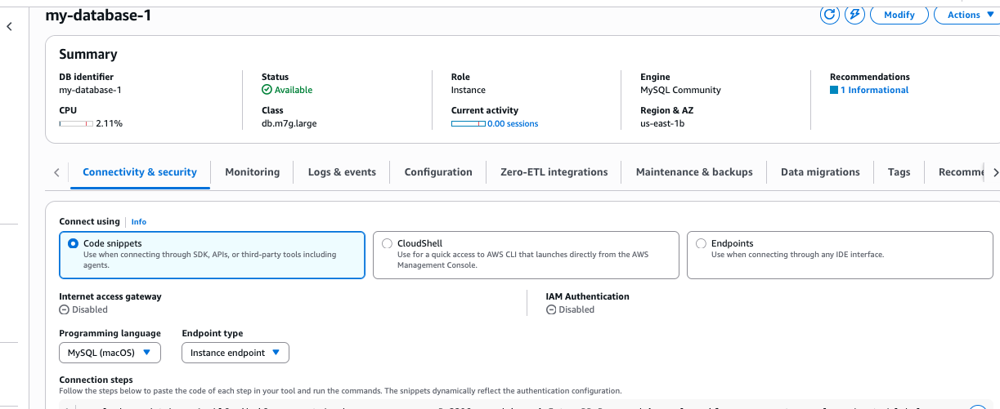
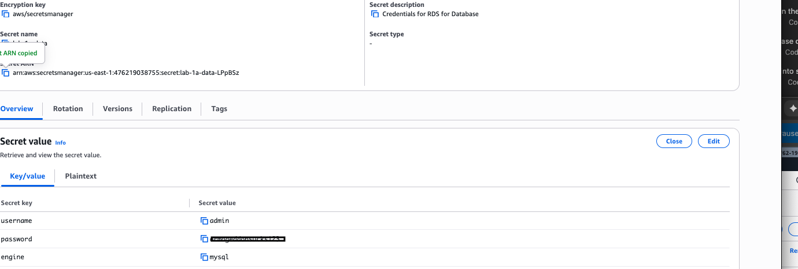
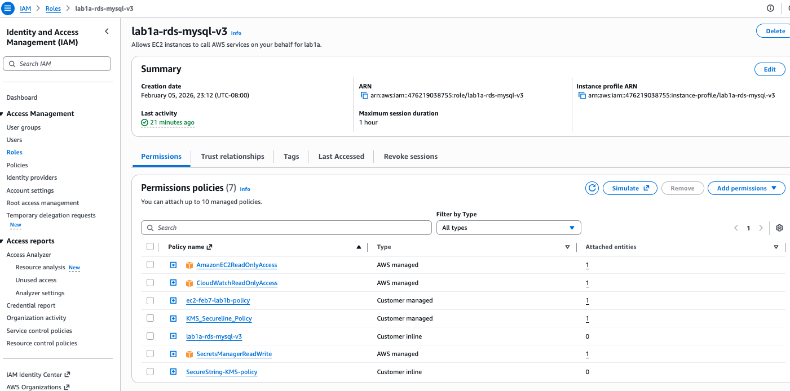
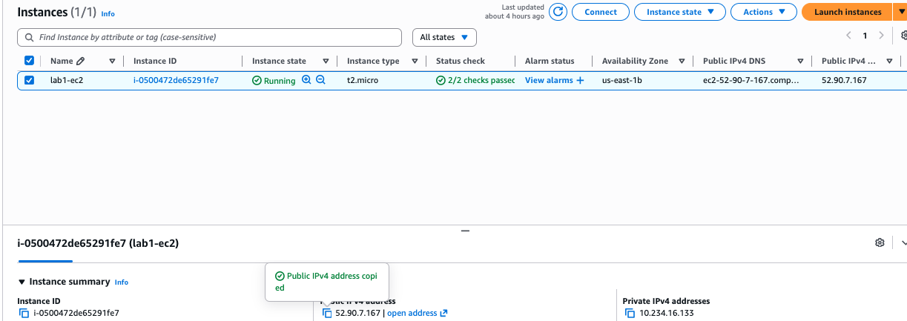
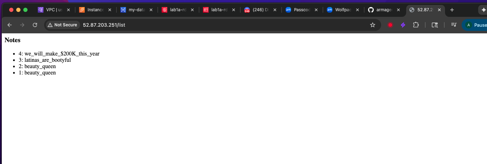
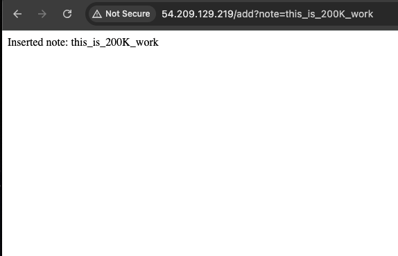

md

#🚀 Lab 1a — Secure EC2 → RDS Integration

## Foundational AWS Cloud Application Architecture

---

## Project Overview

This lab demonstrates a production-style AWS backend architecture  where:


- Amazon EC2 runs an application server
- Amazon RDS (MySQL) serves as a managed database
- Security Groups enforce least privilege networking
- IAM roles eliminate static credentials
- AWS Secrets Manager securely stores database credentials


The objective is not application complexity — the objective is secure infrastructure design and verification.

This architecture pattern is used in:
- SaaS platforms  
- Enterprise backend services  
- DevOps environments  
- Cloud security assessments  
- Lift-and-shift workloads  

---

## 🏗 Architecture Overview

This lab was built using a layered cloud architecture model.  
Each layer enforces a specific responsibility and security boundary.

1. VPC creates the isolated network boundary (Network Foundation)
2. Security Groups define allowed communication (Nework Access Control)
3. RDS provides managed database in private subnet (Database Layer)
4. Create a Secrets Manager for credential secure storage 
5. EC2 application (Application Layer):
   - Retrieves DB credentials from Secrets Manager
   - Retrieves endpoint and port from Parameter Store

The system was built in the following order:
### Logical Flow

1. User sends HTTP request to EC2
2. EC2 application:
   - Retrieves DB credentials from Secrets Manager
   - Retrieves endpoint and port from Parameter Store
3. EC2 connects to private RDS endpoint
4. Database processes request
5. Response returned to user
---

## Architecture Screenshot


## Creating a VPC
1. Connect to AWS and log in to your console.
2. Search for VPC and open the VPC dashboard.
3. Click on create VPC
4. Select VPC and more for VPC settings
5. Name your VPC <lab-1a-vpc>
6. Input your IPv4 CIDR block <10.234.0.0/16>
7. Select Number of Availability Zones (AZs) <3>
8. Select number of public and private subnets <3>
9. Click on customize subnets CIDR blocks and assign the CIDR blocks for each private and public subnet
10. Select Regional - New, for NAT gateways
11. Ensure that none is selected for VPC endpoints.
12. Click on Create VPC to create the VPC.

How I setup my CIDR Range & VPC setup

VPC CIDR: 10.234.0.0/16
Region:    us-east-1
VPC Name: lab-1a-vpc

## Public Subnets: 

Subnet-public-1a: 10.234.0.0/24
Subnet-public-1b: 10.234.16.0/24
Subnet-public-1c: 10.234.32.0/24


## Private subnets:

Subnet-private-1a: 10.234.128.0/24
Subnet-private-1b: 10.234.144.0/24
Subnet-private-1c: 10.234.160.0/24


## Security Design
Security was implemented intentionally and mirrors production systems. Security Groups act as virtual firewalls. 

- Name: ec2-lab-sg
- Description: Security Group for lab1 EC2 Instance 
- VPC: lab-1a-vpc
- Inbound Rules: 
-      -Type: HTTP, Port 80, Source: Anywhere- IPv4 0.0.0.0/0, Description: HTTP
-      - Type: SSH, Port: 22, Source: MyIP(auto-detects your current IP)
-  Outbound rules: Default (allow all)

3. Click on Create security group

1. In the VPC dashboard, select Security Groups from the left menu.
2. Click on Create security group.


RDS inbound rule:

TCP 3306
Source = EC2 Security Group ID
No 0.0.0.0/0 exposure
EC2 handles public HTTP traffic

This enforces least-privilege communication.
Only the application server can reach the database.


---
### RDS- Managed Database Layer

Amazon RDS was configured:
-MySQL engine
-Private subnet
-Public access disabled
-Accessible only from EC2 security group


Why is it essential?
In production:
1. You should not run databases directly on EC2
2. Managed services reduce operational burden
3. it improves reliability and security posture as it demonstrates separation of compute and data layers.

## Steps on creating a Database Security Group
1. In Aurora and RDS click on Subnet Groups in the left menu.
2. Click on Create DB Subnet Group
3. Fill in the Name and Description of your subnet group
4. Choose the appropriate VPC for your subnet group
5. Under the Add subnets heading, click select the Availability zones for your subnet
6. On the Subnets dropdown, select ONLY the private subnets associated with your availability zones selected earlier
7. In the Subnets selected box, review and confirm that only private subnets have been selected and then click create to complete the creation of your subnet group. 

## AWS Secrets Manager (Credential Storage)

AWS Secrets Manager securely stores sensitive information such as:
* Database passwords
* API Keys
* Tokens
* Certificates

It supports:
* Encryption at rest
* Versioning
* Rotation

It is essential because hardcoding passwords is a critical security flaw.

Without Secrets Manager:
* Credentials would live in code
* Rotating secrets would require redeployments
* Breaches would be harder to contain

In this Lab:
* DB credentials stored securely
* Application retrieves them dynamically
* No password stored in source code

This demonstrates secure configuration management.

## Identity & Credential Management

An IAM role is an AWS identitiy that grants permissions to resources.
Instead of storing AWS keys on the server:
* The EC2 instance assumes a role
* Temporary credentials are provided automatically

Without IAM roles:
* Static credentials must be stored
* Credential leakage risk increases
* Rotation becomes complex

In this lab: 
-EC2 uses an IAM instnace profile
-No static AWS credentials stored on server
-Secrets Manager stores database credentials
-Parameter Store stores non-secret configuration
-Application retrieves configuration dynamically at runtime


---
### Amazon EC2 (Compute Layer)

Amazon EC2 provides scalable virtual compute instances
It runs on:
* Applications
* APIs
* Backend services
* Container runtimes

They are essential because EC2 serves as a compute layer that:
* Receives user requests
* Executes business logic
* Connects to backend services
* Returns responses

In this lab:
* EC2 hosted the web application
* EC2 was placed in public subnet
* EC2 connected privately to RDS

This models the real world pattern revolving public application layer and private database layer. 

### Final Infrastrucure Flow (Layered Architecture)
1. VPC creates the isolated network boundary
2. Security Groups define allowed communication
3. RDS provides managed database in private subnet
4. EC2 hosts application in public subnet
5. Secrets Manager stores database credentials
6. IAM role allows EC2 to retrieve secrets securely

Only after all these layers are in place does:
* Application logic execute
* Database connectivity succeed
* End to end trust exist



In the EC2, you will paste the bash script into the user data and the results should come out like this:

 

How you do it is paste your public IP along with the list:
http://public IP/init

http://public IP/add?note=first_note

http://public IP/list

## ✅ CLI Verification (Before Accessing the Database)
Before connecting to the database, I validate the infrastructure layers in the correct order: 
EC2 exists -->IAM role attached --> RDS exists and is available --> RDS endpoint known --> Security Groups allow DB traffic --> Secrets can be retrieved --> then connect to MYSQL.
This prevents "guesswork" and mirrors real troubleshooting and on-call workflows.

## 1) Verify EC2 instance exists (by Name tag)
```bash
aws ec2 describe-instances \
  --filters "Name=tag:Name,Values=lab1-ec2" \
  --query "Reservations[].Instances[].InstanceId"
```

This command finds the EC2 instance using its Name tag and returns the instance ID. If nothing returns, the instance doesn't exist or the tag name is wrong. 

## Verify IAM role is attached to EC2
```bash
aws ec2 describe-instances \
  --instance-ids <instance-id> \
  --query "Reservations[].Instances[].IamInstanceProfile.Arn" \
  --output text
```
# Verify RDS Instance Status
```bash
aws rds describe-db-instances \
  --db-instance-identifier <RDS_IDENTIFIER> \
  --query "DBInstances[].DBInstanceStatus" \
  --output text
```
  This confirms the database is online and ready.
  If it's stopped, starting, or not available, the app/DB connection can fail.
## Get RDS Endpoint
```bash
aws rds describe-db-instances \
  --db-instance-identifier <RDS_IDENTIFIER> \
  --query "DBInstances[].Endpoint" \
  --output json
```
  Returns the database hostname and port (usually 3306). You need to value this to connect from EC2 using the MYSQL client.
  
## Verify Security Group rules allow DB traffic (TCP 3306)
```bash
aws ec2 describe-security-groups \
  --filters "Name=vpc-id,Values=<VPC_ID>" "Name=group-name,Values=<RDS_SECURITY_GROUP_NAME>" \
  --query "SecurityGroups[].IpPermissions" \
  --output json
```
Confirms the RDS security group allows inbound TCP 3306 from the correct source. Best practice is source =EC2 security group, not 0.0.0.0/0. If this is wrong, you'll get timeouts or connection refused.

## Retrieve credentials from Secret Manager (From inside EC2)
```bash
aws secretsmanager get-secret-value \
  --secret-id <SECRET_ID> \
  --query "SecretString" \
  --output text
```
  Returns the stored database credentials securely (username/password). If this fails with AccessDenied, IAM role policy is missing Secrets Manager permissions.
  
## Install MYSQL Client
```bash
sudo dnf install -y mysql
```
Installs the MYSQL CLI so you can test connectivity directly from the EC2 host.

## Connect to Database
```bash
mysql -h my-database-1.ckl6wuikmi6s.us-east-1.rds.amazonaws.com \
  -u admin -p
```
Attempts a live database connection using the endpoint and credentials.
Common failure meanings:

*timeout → networking / security group issue
*access denied → wrong password / secret drift / user permissions
*unknown host → wrong endpoint / DNS / config issue

